https://rocklrock.github.io/badminton-delight/

# Table of Contents
  - Introduction
  - Project Overview
  - Pages Included
  - Screenshots of pages and sections
  - Technologies Used
  - Site-wide SEO / Technical Enhancements
  - Testing
  - Bugs/Errors
  - About AI
  - Credits

# Badminton Delight – A Local Badminton Website

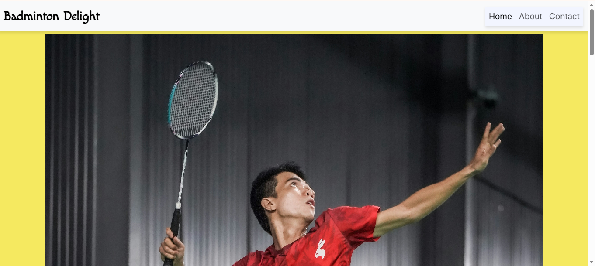
Badminton Delight is a community of badminton enthusiasts based in London Regent's Park. We are dedicated to promoting the sport of badminton, fostering a friendly and inclusive environment for players of all skill levels.


## Project Overview
- Purpose: Homepage for Badminton Delight — introduces the club, benefits, meetups, and links to About/Contact pages.
- Key sections: `#hero` (hero image + title), `#benefits` (four cards), `#meet-up-up` (meetup times + map), footer with social links.
- Tech: Built with Bootstrap, Font Awesome, site styles in `assets/css/styles.css`, images in `assets/images/`.
- Accessibility & perf: Images include alt text; non-critical images lazy-load; preconnect/preload hints and deferred scripts improve load times.
- Preview locally: run `python -m http.server 8000` from the project root and open `http://localhost:8000`.


## Pages Included

- `index.html` — Homepage with hero, benefits cards, meetup times and an embedded map for Regent's Park.
- `About.html` — Background and history of Badminton Delight, including community information and meeting details.
- `Contact.html` — Contact form for enquiries; submits to `Success.html` and includes basic client-side validation.
- `Success.html` — Simple confirmation page shown after a successful form submission.

## Screenshots of pages and sections

- `index.html` (homepage):

  
  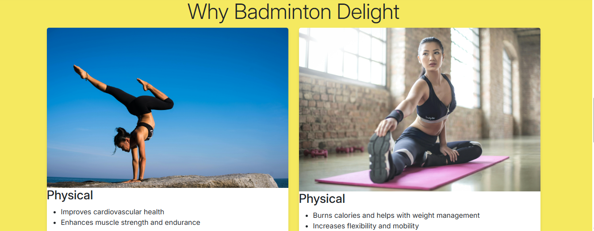
  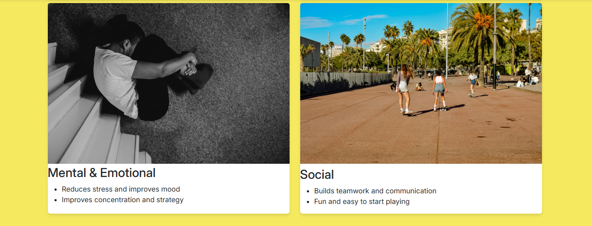
  

  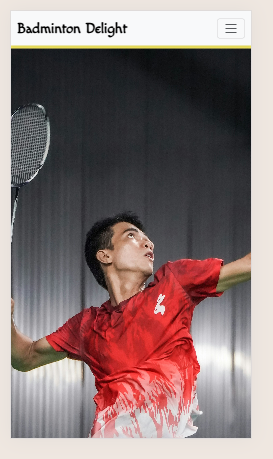
  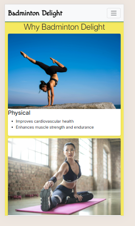
  
  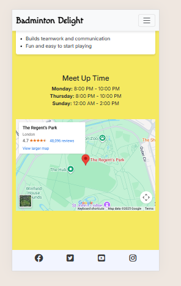

- `About.html`:

  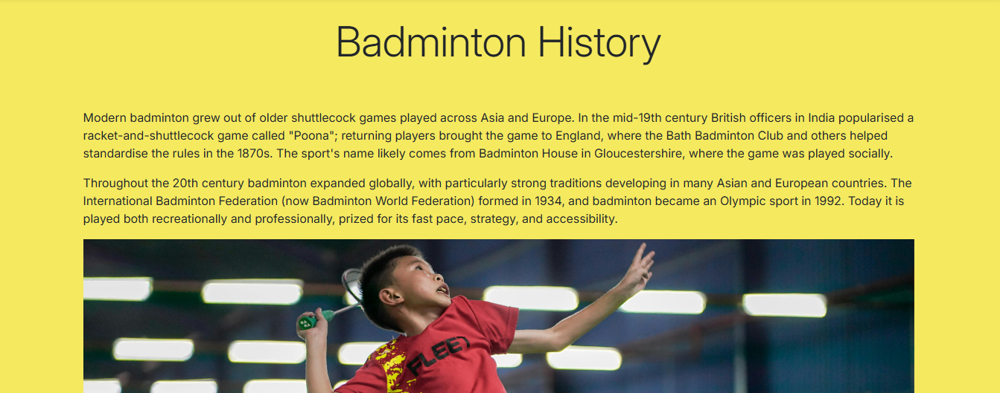
  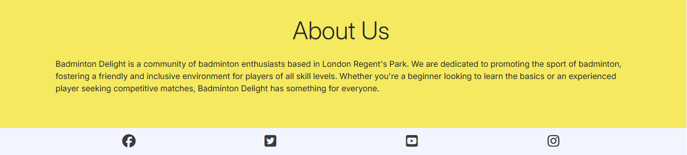

  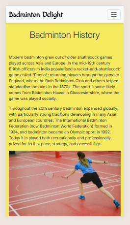
  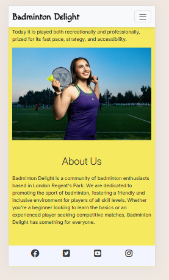

- `Contact.html` (form):

  
  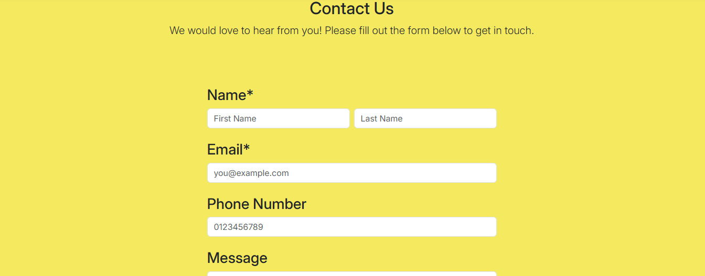
  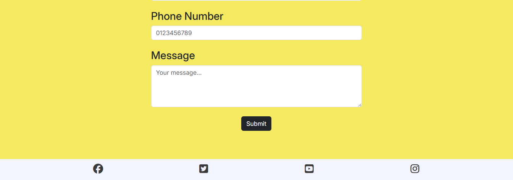

  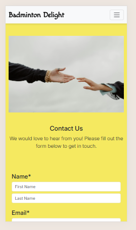
  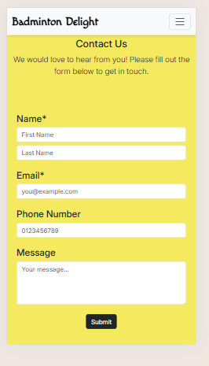
  
  
- `Success.html` (confirmation):

  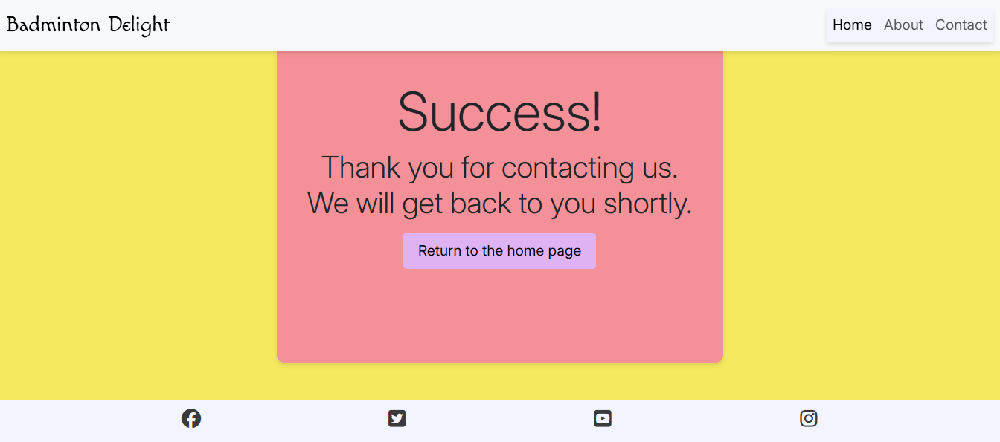
  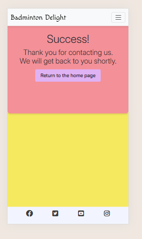

   
## Technologies Used

- **HTML5:** Semantic markup used across pages (`index.html`, `About.html`, `Contact.html`, `Success.html`) for accessibility and SEO.
- **CSS3 + Variables:** Custom styling, responsive layout and theme variables (CSS custom properties) live in `assets/css/styles.css`.
- **Bootstrap 5:** Grid, responsive utilities and components (navbar, cards, carousel) used from the CDN for consistent layout and faster development.
- **Google Fonts:** Remote fonts for typography; `preconnect` hints are used to improve load times.
- **Font Awesome:** Icon kit for social and UI icons (loaded with `defer` to avoid blocking rendering).
- **Images & Media:** Local images in `assets/images/`; performance techniques include `loading="lazy"`, `decoding="async"`, explicit `width`/`height`, and `preload` for LCP-critical images. `object-fit: cover` is used for responsive covers.
- **Embeds:** Google Maps iframe for location with a descriptive `title` for accessibility.
- **Client-side JS patterns:** Small progressive scripts only where needed (form-state saved to `sessionStorage` and restored on `pageshow`, minimal IntersectionObserver usage for decorations). Bootstrap’s JS bundle (CDN) powers interactive components.
- **Performance & Best Practices:** Preconnect/preload resource hints, defer noncritical third-party scripts, inline small critical CSS for above-the-fold content, and lazy-loading of nonessential assets.
- **Accessibility:** Alt text on images, semantic headings and landmarks, keyboard-accessible controls, and ARIA-friendly attributes where applicable.
- **Testing & Validation:** Lighthouse audits (Performance/Accessibility/Best Practices/SEO) and W3C HTML/CSS validation used to verify quality.
- **Local preview / dev:** Use a simple static server for testing:
  ```powershell
  cd C:\Users\Holy\Documents\code-bootcamp\badminton-delight
  python -m http.server 8000
  # open http://localhost:8000
  ```

## Site-wide SEO / Technical Enhancements

- Preconnect & Preload: preconnect and preload hints added for critical resources (fonts/hero image) on index.html to reduce connection and resource-load latency.
- Lazy loading: Non-critical images marked with loading="lazy" to reduce initial payload and improve LCP/FCP.
- Decoding & fetchpriority: Images set with decoding="async" and some critical images used fetchpriority to prioritize key assets.
- Script loading: Non-critical third-party scripts deferred to avoid render-blocking (e.g., Font Awesome deferred).
- Responsive images & CSS: Carousel/hero images made responsive via CSS (object-fit, responsive heights) to avoid layout shifts and improve Core Web Vitals.
- Accessibility for SEO: Improved semantics and alt text on images, plus descriptive title added to the Google Maps iframe to improve accessibility and search engine understanding.


## Testing

### Manual Testing

- All internal navigation links work correctly across all screen sizes and devices
- Responsive layout tested on mobile (344px), tablet (768px), and desktop (1440px+) devices

### Validation

- **HTML Validation**: All pages validated through the [W3C Markup Validation Service](https://validator.w3.org/). No critical errors found. Minor warnings are intentional due to form structure without server-side submission.
- **CSS Validation**: Stylesheets passed validation via [W3C CSS Validation Service](https://jigsaw.w3.org/css-validator/), including use of valid CSS custom properties.

 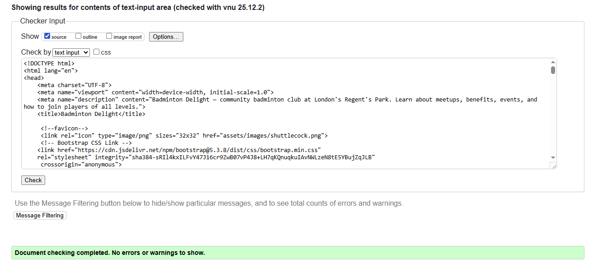
 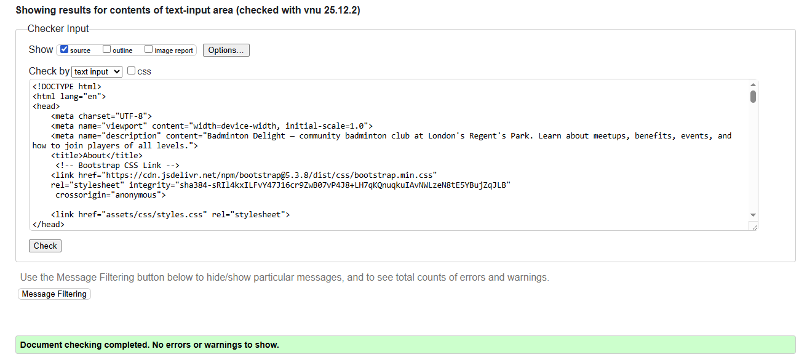
 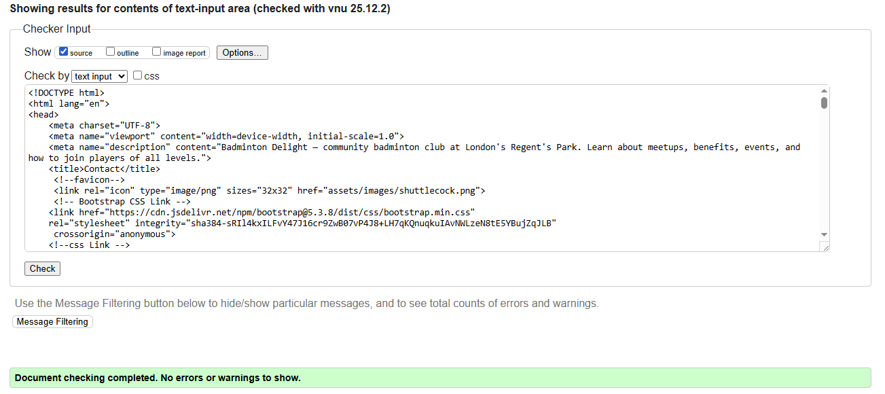
 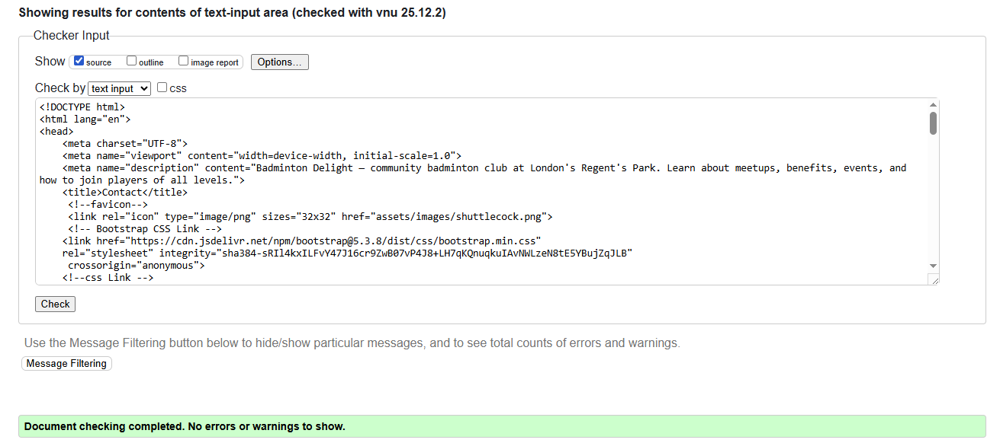
 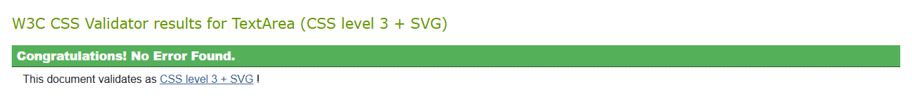

- **Lighthouse Testing**: Conducted in Chrome DevTools on desktop.
- (on average)
  - Performance: 70-98
  - Accessibility: 100
  - Best Practices: 100
  - SEO: 100
  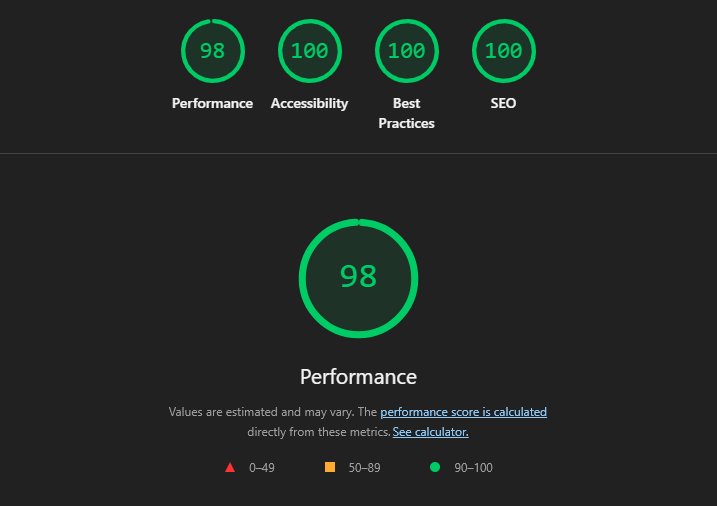
  These scores reflect a well-optimized and accessible site. Performance may vary slightly across networks or browsers.

## Deployment Procedure
The webiste is developed in VS code IDE and deployed in github. The link to the website is at the top of this document.

## Bugs/Errors
There is no known bugs/errors in the current version of website.

## About AI
In this project , AI is used to provide SEO optimisation and performance improvement. Sometimes it also used for troubleshooting purpose. Some part of this document is helped by AI.

## Crdeits
The pictures of this project are taken from the following websites and appreciated their usefulness and helpfulness:

https://unsplash.com/s/photos/badminton 
https://www.pexels.com/
https://www.flaticon.com/authors/mehwish 


